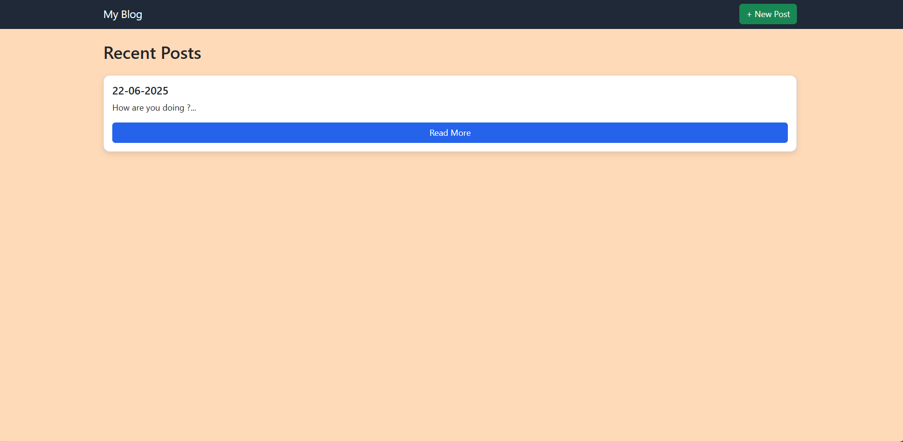

# Personal-Blog-Site
This is a simple and clean blog app built with Flask. You can create, read, update, and delete posts—all in your browser. It uses in-memory storage (no database needed) and comes with a responsive design thanks to Bootstrap. Perfect for learning Flask basics!
# 📝 Simple Flask Blog

A minimal blog application built using [Flask](https://flask.palletsprojects.com/) and [Bootstrap 5](https://getbootstrap.com/), designed for learning and rapid prototyping.

## 🚀 Features

- 🏠 Home page listing recent posts
- ➕ Add new posts
- ✏️ Edit existing posts
- ❌ Delete posts with confirmation
- 📄 View full blog post content
- 🎨 Responsive design with Bootstrap
- ⚡ In-memory storage (no database required)

## 📸 Screenshot

> Replace the screenshot URL above with a real screenshot after deploying.

---

## 🛠 Tech Stack

- **Backend:** Python, Flask
- **Frontend:** HTML, Bootstrap 5
- **Templating:** Jinja2
- **Storage:** In-memory list (can be extended to use SQLite or another DB)

---

## 📂 File Structure
my_project/
│
├── app.py
└── templates/
    └── template.html

